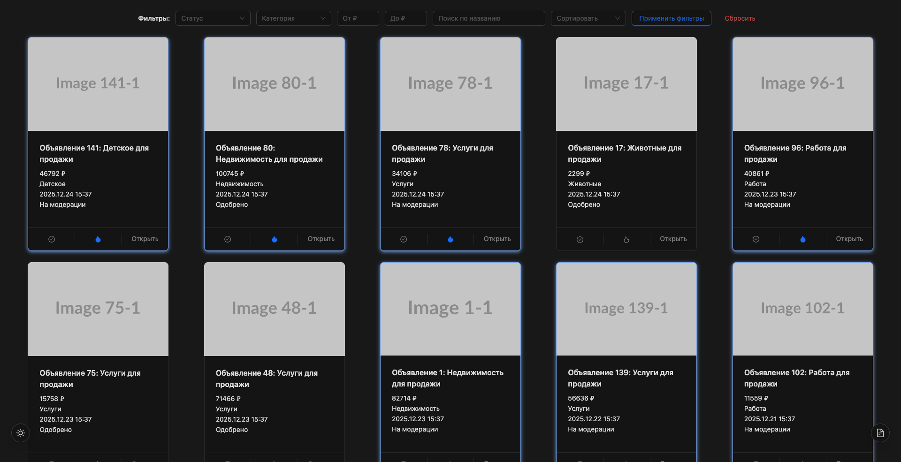

# Система управления объявлениями для модерации

Запуск проекта: `npm install` и `npm run dev` в папках `client` и `server`

## Бизнес-контекст

Ежедневно на Площадке-N публикуются тысячи объявлений, которые должны пройти модерацию перед публикацией. Модераторам нужен удобный инструмент для быстрой проверки объявлений, принятия решений и отслеживания своей эффективности.

## Технологический стэк:

TypeScript, React, MobX, Tanstack Query, React Router, Vite, Ant Design, Chart.js

## Описание

Система модерации предоставляет удобный интерфейс для работы, функционал включает:

- просмотр списка объявлений с пагинацией (/list)
- фильтрацию, сортировку и поиск по списку объявлений с синхронизацией через URL
- действия с объявлениями: одобрение, отклонение, отправка на доработку, возможность выбора нескольких объявлений для массовых действий и оставление комментариев (/item/[:id])
- отображение статистики по своей работе в виде графиков и таблиц с выбором периода статистики (/stats)
- темная и светлая тема с возможностью переключения и сохранением выбора
